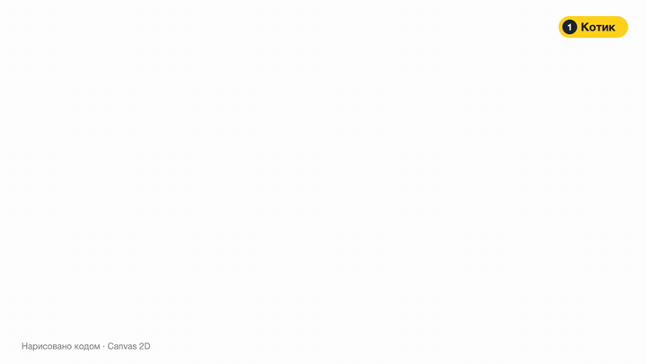
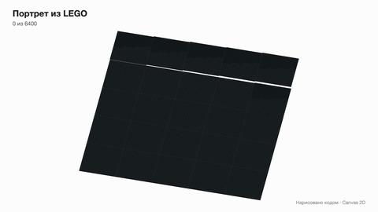
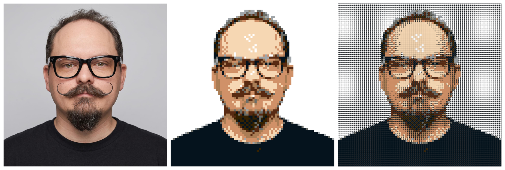
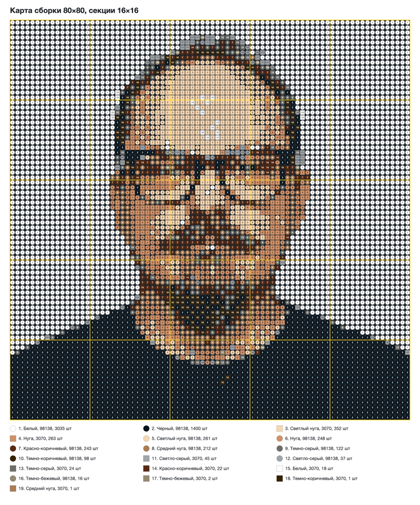
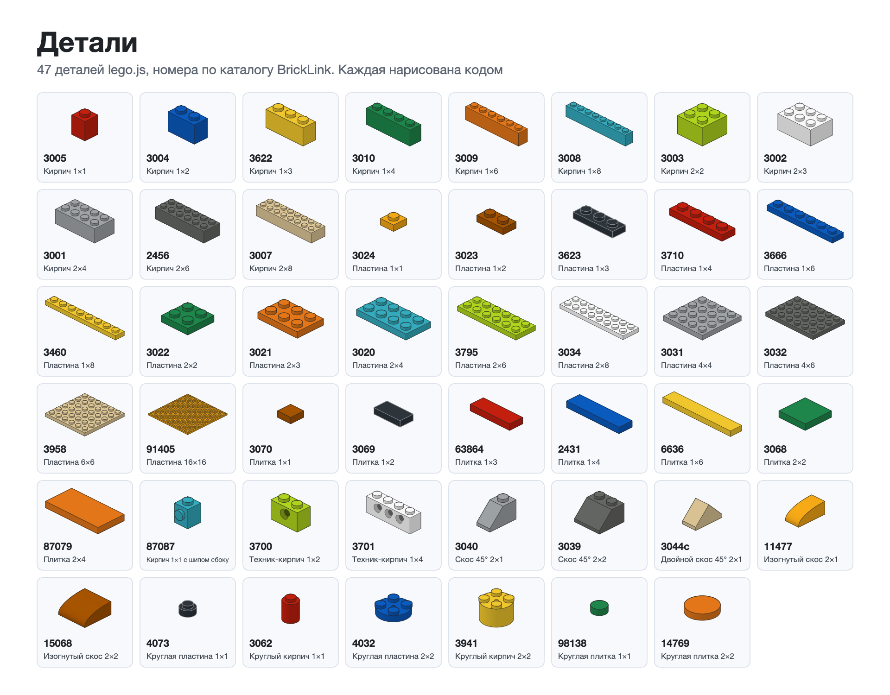

# lego-build



Анимация сборки из деталей LEGO в стиле фирменной инструкции. Каждый кадр нарисован кодом на Canvas 2D, без картинок, моделей и 3D-движка. Модель задается списком шагов, а движок сам рисует страницу инструкции со списком деталей, номером шага, падающими кирпичами и желтой обводкой новых деталей, а в конце поворачивает готовую модель.

Внутри лежит пример, рыжий кот из 106 настоящих деталей. Каждая пара деталь плюс цвет сверена с каталогом BrickLink, морда держится на кирпичах с шипом сбоку, печати нет.

Готовые ролики лежат в папке media, вертикальный [cat.mp4](media/cat.mp4) и горизонтальный [cat-16x9.mp4](media/cat-16x9.mp4).

## Посмотреть

Откройте `index.html` в браузере. Пробел или клик ставят на паузу, стрелки листают по кадру.

- `index.html?format=horizontal` горизонтальная версия 1920×1080
- `index.html?model=microduck` второй пример, мини-робот
- `index.html?view=parts` каталог всех 47 деталей
- `index.html?t=12` открыть на 12-й секунде

## Сделать видео

Нужны Node.js 20 или новее и ffmpeg.

```bash
npm install
npx playwright install chromium
node tools/render.cjs --model cat
node tools/render.cjs --model cat --format horizontal
```

Ролики появятся в папке `exports`.

## Портрет из фото



Фото превращается в мозаику из круглых и квадратных плиток 1×1 на черных пластинах 16×16, как в наборах LEGO Art. Один шип равен одному пикселю, а каждой клетке достается настоящая плитка в цвете, который реально выпускается. Цвета сравниваются так, как их видит глаз (CIELAB, CIEDE2000). Палитра подбирается под конкретное фото, соседние плитки смешиваются в промежуточные тона, одиночные точки убираются. Черно-белое фото определяется само и собирается из четырех серых.

На выходе получаются картинка, карта сборки с номером цвета на каждом шипе, список деталей с номерами BrickLink и ролик. В ролике камера летит вдоль фронта сборки, а в конце встает над портретом, и рядом появляется фото. Пример выше собран из студийного портрета, мозаика 80×80, 6400 плиток. Целиком ролик лежит в [mosaic.mp4](media/mosaic.mp4).

```bash
node tools/mosaic.cjs photo.jpg --size 80 --video
node tools/mosaic.cjs photo.jpg --video --format vertical
node tools/mosaic.cjs photo.jpg --frames 3,9,15
```

| Ключ | Что делает | По умолчанию |
|---|---|---|
| `--size` | сторона мозаики в шипах, кратно 16, от 16 до 256 | 64 |
| `--shape` | `mixed` круглые и квадратные, `round` как LEGO Art, `square` | mixed |
| `--palette` | `portrait` спокойные цвета, `all` все цвета плиток | portrait |
| `--colors` | сколько цветов взять, от 1 до 42 | 12 |
| `--dither` | смешивание соседних плиток, от 0 до 1 | 0.5 |
| `--contrast` | растяжка тонов, от 0 до 1 | 0.5 |
| `--sharpen` | резкость черт, от 0 до 2 | 0.5 |
| `--saturation`, `--brightness` | насыщенность от 0 до 3, яркость от -50 до 50 | 0.9, 0 |
| `--zoom`, `--dx`, `--dy` | кадрирование лица, зум от 1, сдвиги от -0.5 до 0.5 | 1, 0, 0 |
| `--format` | `horizontal` 1920×1080 или `vertical` 1080×1920 | horizontal |
| `--out` | папка для результатов | exports |

Результаты ложатся в папку `exports` проекта, вертикальный ролик называется `<имя>-build-vertical.mp4`. Инструмент понимает JPEG, PNG, WebP, GIF, BMP и AVIF. HEIC с айфона сначала пересохраните в JPEG. Прозрачный фон ложится на белый.

Или откройте `mosaic.html`, перетащите фото и крутите настройки в браузере. Оттуда же скачиваются картинка, карта сборки и видео. Видео в браузере пишется в реальном времени, поэтому на больших мозаиках может дергаться, ровное дает консольная команда. Фото никуда не отправляется.



<details><summary>Карта сборки</summary>



</details>

## Своя модель

1. Скопируйте `src/models/cat.js` в `src/models/<имя>.js`, поменяйте шаги и в последней строке замените `root.MODELS.cat` на `root.MODELS.<имя>`.
2. Добавьте файл строкой `<script src="src/models/<имя>.js"></script>` в `index.html`.
3. Проверьте модель командой `node tools/check-model.cjs <имя>`. Скрипт найдет пересекающиеся детали и детали, которые ни на чем не держатся.
4. Откройте `index.html?model=<имя>` и отрендерьте ролик.

Координаты, крепление деталей сбоку и частые ошибки описаны в [reference/modeling.md](reference/modeling.md), все детали и цвета собраны в [reference/parts.md](reference/parts.md).

## Скилл для агента

Папка целиком является скиллом для Claude Code и других агентов с поддержкой SKILL.md. Установите ее так.

```bash
git clone https://github.com/siliconbag/lego-build ~/.claude/skills/lego-build
```

Дальше просто попросите агента, например «собери из лего сову и сделай горизонтальный ролик». Агент спроектирует модель из настоящих деталей, сверит цвета по каталогу, прогонит проверку и отрендерит видео. Инструкция для агента лежит в [SKILL.md](SKILL.md).

## Детали



## Откуда это

Стиль подсмотрен у фанатского буклета [Microduck](https://huggingface.co/buckets/victor/microduck-lego-booklet), где LEGO-модель робота Pollen Robotics собрана из 1113 деталей.

LEGO является товарным знаком LEGO Group, которая не спонсирует и не одобряет этот проект. Модели проверены только на компьютере, живьем их никто не собирал.

## Лицензия

MIT
